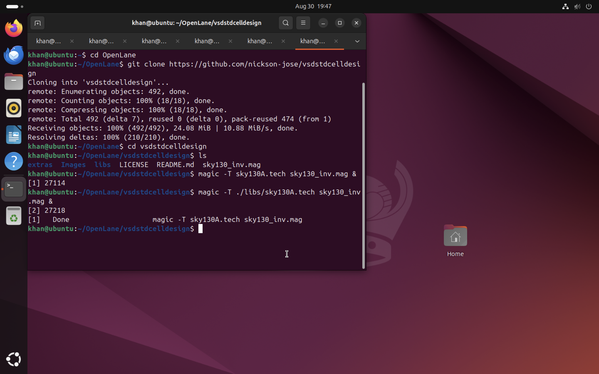
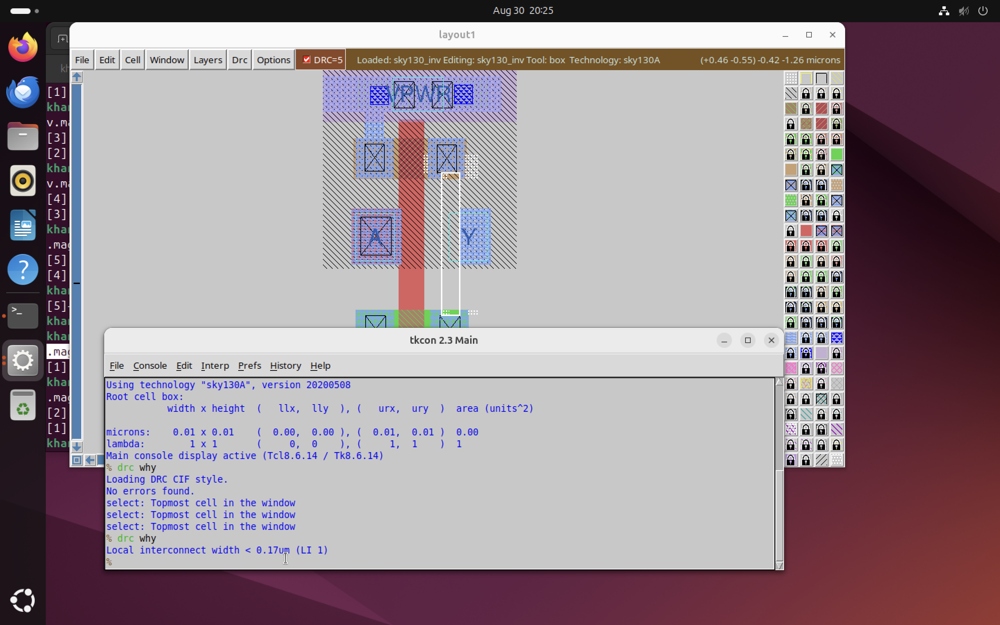
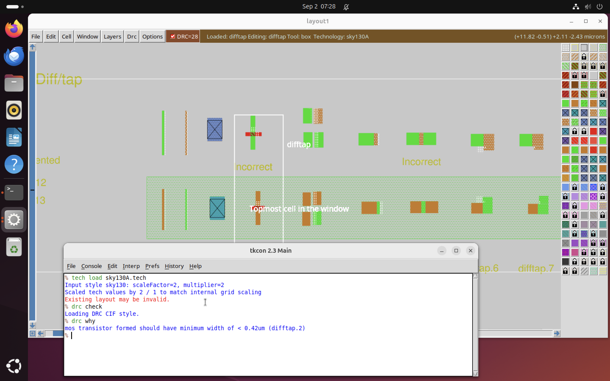
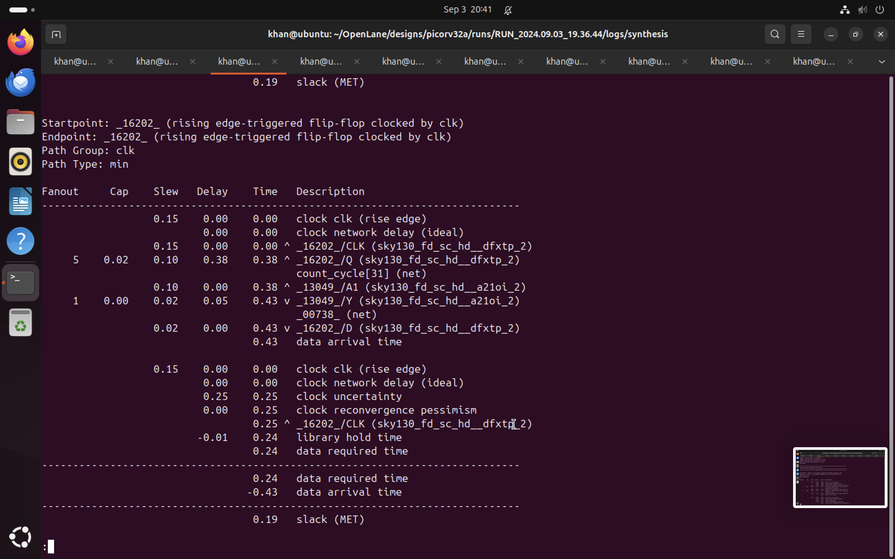

#  SoC Design and Planning Training


## Lessons Learned

### Understanding the RTL to GDS Flow

- **End-to-End Process:** Grasped the end-to-end process of converting a high-level hardware description to a physical ASIC layout.
- **Importance of Each Step:** Recognized the importance of each step in the flow, from synthesis to sign-off.

### Synthesis

- **Conversion to Gate-Level Netlist:** Learned how RTL is converted to a gate-level netlist using standard cell libraries.
- **Cell Views:** Identified the different views of cells (Liberty, HDL, SPICE, Layout).

### Floor and Power Planning

- **Significance of Floor Planning:** Understood the significance of floor planning in chip partitioning and I/O pad placement.

## Table of Contents
- [Day - 1 Inception of Open-Source EDA, OpenLane and Sky130 PDK](#day---1-inception-of-open-source-eda-openlane-and-sky130-pdk)
- [Day - 2 Good Floor plan Vs Bad floor plan](#day---2-good-floorplan-vs-bad-floorplan-and-introduction-to-library-cells)
- [Day - 3 Design Library Cells using magic](#day--3-design-library-cell-using-magic-layout-and-ngspice-charcterization)
- [Day - 4 Timing Analysis and Clock Tree Synthesis](#day-4-timing-analysis-and-clock-tree-synthesis-cts)
- [Day - 5 Final Steps in RTL2GDS](#day-5--final-steps-in-rtl2gds)
- [Acknowledgement](#acknowledgement)
- [References](#references)

## Day - 1 
## Inception of Open-Source EDA, OpenLane and Sky130 PDK
### Introduction to RISC-V
RISC-V is an open-source instruction set architecture (ISA) that is adopted in the world of computer architecture and processor design. It was originally developed at the University of California, Berkeley in 2010 and has since grown into a global collaboration of researchers and industry experts. The key characteristic of RISC-V is its simplicity and modularity. It follows the Reduced Instruction Set Computer (RISC) design philosophy, which emphasizes a small and streamlined set of instructions that are easy to decode and execute. RISC-V offers a base set of instructions, called the "RV32I," which provides essential operations for general-purpose computing. Additional optional instruction sets, such as RV32F for single-precision floating-point operations or RV64G for 64-bit computing, can be added to meet specific application requirements. One of the major advantages of RISC-V is its open nature. The ISA specifications, reference implementations, and software tools are freely available, allowing anyone to study, modify, or implement their own RISC-V processors without licensing fees or restrictions. This openness has fostered a vibrant ecosystem of hardware designers, software developers, and researchers who collaborate and innovate around the RISC-V architecture.

### How the software applications run on the hardware ?
All the software applications we use in our daily lives rely on hardware to run. The system software is responsible for translating the application program into binary language, which the hardware can understand and execute. The primary components of system software include the Operating System (OS), Compiler, and Assembler. The OS plays a crucial role in managing various aspects of the computer system. It provides an environment for the application program to run and handles tasks such as memory management, process scheduling, and input/output operations. Depending on the underlying architecture, such as MIPS, x86, x64, or RISC-V, the OS translates the application program into assembly language instructions. The compiler is responsible for converting high-level programming languages, like C or Java, into assembly-level language instructions. This translation process is influenced by the specific architecture on which the software will be executed. Different architectures have their own instruction sets, and the compiler ensures that the instructions generated are compatible with the targeted architecture. Once the code is in assembly language, the assembler comes into play. It takes the assembly code and translates it into binary code, which is a sequence of 0s and 1s that can be directly dumped into the hardware.


**RTL IPs**, or Register Transfer Level Intellectual Property, refer to pre-designed and pre-verified digital hardware components or blocks that are described at the Register Transfer Level (RTL). RTL is a hardware description language (HDL) representation of a digital circuit or a portion of a circuit. In the context of integrated circuit (IC) design, an IP refers to a reusable building block that can be integrated into a larger design. RTL IPs, specifically, are designed at the register transfer level, which represents the flow of data between registers and the operations performed on that data.These IPs can be licensed from IP vendors or developed in-house. They provide a level of abstraction that allows designers to focus on higher-level design aspects rather than implementing low-level details from scratch. RTL IPs offer various advantages, such as improved productivity, faster time-to-market, and increased design reliability. By using RTL IPs, designers can leverage optimized and well-tested building blocks, reducing the likelihood of errors and bugs. Additionally, using RTL IPs promotes design reuse, enabling designers to create complex systems by assembling and integrating different IP blocks.

**EDA (Electronic Design Automation) tools** are software applications used in the design, development, and analysis of electronic systems, including integrated circuits (ICs), printed circuit boards (PCBs), and other electronic components. These tools automate various tasks involved in the design process, increasing efficiency and reducing time-to-market.

**Process Design Kit (PDK)** is a set of files used within the semiconductor industry to model a fabrication process for the design tools used to design an integrated circuit.  PDK’s are often specific to a foundry, and may be subject to a non-disclosure agreement.  While most PDK’s are proprietary to a foundry, certain PDKs are opensource and entirely within the public domain.Traditionally, PDKs have been proprietary and provided by semiconductor foundries, limiting access and customization options for IC designers. However, open-source PDKs aim to promote collaboration, innovation, and accessibility by making the design kit freely available to the community. By providing an open-source PDK, designers can modify and customize the kit to suit their specific requirements. This flexibility allows for greater innovation, collaboration, and knowledge sharing within the design community. It also lowers the barriers to entry for new designers and encourages participation in the development of new ICs and electronic systems. Some of the  open-source PDKs are : SKY130, GFU180, ASAP7 etc

### Simplified RTL to GDSII flow 
The RTL to GDSII flow basically involves :
1. **RTL Design** -  The process begins with the RTL design phase, where the digital circuit is described using a hardware description language (HDL) like VHDL or Verilog. The RTL description captures the functional behavior of the circuit, specifying its logic and data paths.

2. **RTL Synthesis** - RTL synthesis converts the high-level RTL description into a gate-level netlist. This stage involves mapping the RTL code to a library of standard cells (pre-designed logic elements) and optimizing the resulting gate-level representation for area, power, and timing. The output of RTL synthesis is typically in a format called the gate-level netlist.

3. **Floor and Power Planning** - is a crucial step in the digital design flow that involves partitioning the chip's area and determining the placement of major components and functional blocks. It establishes an initial high-level layout and defines the overall chip dimensions, locations of critical modules, power grid distribution, and I/O placement.The primary goals of floor planning are: Area Partitioning, Power Distribution, Signal Flow and Interconnect Planning, Placement of Key Components, Design Constraints and Optimization.

4. **Placement** - Placement involves assigning the physical coordinates to each gate-level cell on the chip's layout. The placement process aims to minimize wirelength, optimize signal delay, and satisfy design rules and constraints. Modern placement algorithms use techniques like global placement and detailed placement to achieve an optimal placement solution.

5. **Clock Tree Synthesis** - Clock tree synthesis (CTS) is a crucial step in the digital design flow that involves constructing an optimized clock distribution network within an integrated circuit (IC). The primary goal of CTS is to ensure balanced and efficient clock signal distribution to all sequential elements (flip-flops, registers) within the design, minimizing clock skew and achieving timing closure.

6. **Routing** - Routing connects the gates and interconnects on the chip based on the placement information. It involves determining the optimal paths for the wires and vias that carry signals between different components. The routing process needs to adhere to design rules, avoid congestion, and optimize for factors like signal integrity, power, and manufacturability.

7. **Sign-off** - Sign-off analysis refers to the final stage of the electronic design process, where comprehensive verification and analysis are performed to ensure that the design meets all the necessary requirements and specifications. It involves a series of checks and simulations to confirm that the design is ready for fabrication and meets the desired functionality, performance, power, and reliability targets. 

8. **GDSII File Generation** - Once the layout is verified and passes all checks, the final step is to generate the GDSII file format, which represents the complete physical layout of the chip. The GDSII file contains the geometric information necessary for fabrication, including the shapes, layers, masks, and other relevant details.

### Introduction to OpenLANE
OpenLane is an automated RTL to GDSII flow based on several components including OpenROAD, Yosys, Magic, Netgen, CVC, SPEF-Extractor, KLayout and a number of custom scripts for design exploration and optimization. It also provides a number of custom scripts for design exploration and optimization. The flow performs all ASIC implementation steps from RTL all the way down to GDSII. Currently, it supports both A and B variants of the sky130 PDK, the C variant of the gf180mcu PDK, and instructions to add support for other (including proprietary) PDKs are documented. The whole documentation can be found here [https://github.com/The-OpenROAD-Project/OpenLane].
OpenLane abstracts the underlying open source utilities, and allows users to configure all their behavior with just a single configuration file.


# OpenLane Architecture


#### Open-source Implementation

* For open-source ASIC design implemantation, we require the following enablers to be readily available as open-source versions. They are:-
1. RTL Designs
2. EDA Tools
3. PDK Data

* Initially in the early ages, the design and fabrication of IC's were tightly coupled and were only practiced by very few companies like TI, Intel, etc.
* In 1979, Lynn Conway and Carver Mead came up with an idea to saperate the design from the fabrication and to do this they inroduced structured design methodologies based on the λ-based design rules and published the first VLSI book "Introduction to VLSI System" which started the VLSI education.
* This methodology resulted in the emergence of the design only companies or ***"Fabless Companies"*** and fabrication only companies that we usually refer to as ***"Pure Play Fabs"***.
* The inteface between the designers and the fab by now became a set of data files and documents, that are reffered to as the ***"Process Design Kits (PDKs)"***.
* The PDK include but not limited to Device Models, Technology Information, Design Rules, Digital Standard Cell Libraries, I/O Libraries and many more.
* Since, the PDK contained variety of informations, and so they were distributed only under NDAs (Non-Disclosure Agreements) which made it in-accessible to the public.
* Recently, Google worked out an agreement with skywater to open-source the PDK for the 130nm process by skywater Technology, as a result on 30 June 2020 Google released the first ever open-source PDK.


* ASIC design is a complex step that involves tons of steps, various methodologies and respective EDA tools which are all required for successful ASIC implementation which is achieved though an ASIC flow which is nothing but a piece of software that pulls different tools togather to carry out the design process.


#### OpenLANE Open-source ASIC Design Implementation Flow

* The main objective of the ASIC Design Flow is to take the design from the RTL (Register Transfer Level) all the way to the GDSII, which is the format used for the final fabrication layout.


* Synthesis is the process of convertion or translation of design RTL into circuits made out of Standard Cell Libraries (SCL) the resultant circuit is described in HDL and is usually reffered to as the Gate-Level Netlist.
* Gate-Level Netlist is functionally equivalent to the RTL.


* The fundemental building blocks which are the standard cells have regular layouts.
* Each cell has different views/models which are utilised by different EDA tools like liberty view with electrical models of the cells, HDL behavioral models, SPICE or CDL views of the cells, Layout view which include GDSII view which is the detailed view and LEF view which is the abstract view.


* Chip Floor Planning


* Macro Floor Planning


* Power Planning typically uses upper metal layers for power distribution since thay are thicker than lower metal layers and so have lower resistance and PP is done to avoid electron migration and IR drops.


* Placement


* Global placement provide approximate locations for all cells based on connectivity but in this stage the cells may be overlapped on each other and in detailed placement the positions obtained from global placements are minimally altered to make it legal (non-overlapping and in site-rows)


* Clock Tree Synthesis


* Clock skew is the time difference in arrival of clock at different components.
* Routing


* skywater PDK has 6 routing layers in which the lowest layer is called the local interconnect layer which is a Titanium Nitride layer the following 5 layers are all Aluminium layers.


* Global and Detailed Routing


* Once done with the routing the final layout can be generated which undergoes various Sign-Off checks.
* Design Rules Checking (DRC) which verifies that the final layout honours all design fabrication rules.
* Layout Vs Schematic (LVS) which verifies that the final layout functionality matches the gate-level netlist that we started with.
* Static Timing Analysis (STA) to verify that the design runs at the designated clock frequency.


# LAB WORK


## Installation for MacOS (Apple Chip M1,M2,M3)

So far, we have focused on understanding the OpenLane flow and its functionality. The workshop is tailored for Intel-based chips and Ubuntu. However, since many of the required software tools have not been updated to work with Apple's M1/M2 chips, we need to use some workarounds.

The workshop is designed to run on VirtualBox and virtual machines. Since VirtualBox has not yet released a stable version compatible with Apple's new chips, we will use UTM on macOS instead.

Additionally, the disk image provided for the workshop will not be compatible with UTM. Therefore, you will need to use the unaltered picorv32a design files for this workshop.


###  Steps For Installation Of Ubuntu Using UTM 

* 1.Download and install UTM [https://mac.getutm.app/] 
* 2.Open UTM and click on "Create a New Virtual Machine."
* 3.Select "Virtualize" for the architecture type.
* 4.Choose "Linux" as the operating system.
* 5.Upload the Ubuntu ISO file.
  (Download it from here - [https://ubuntu.com/download/desktop])
* 6.follow this vdieo[here](https://www.youtube.com/watch?v=nUhQy5PDj2A)


### OpenLane Installation
Prior to the installation of the OpenLane install the dependencies and packages using the command shown below :</br>
``` 
sudo apt-get update
sudo apt-get upgrade
sudo apt install -y build-essential python3 python3-venv python3-pip make git

Docker Installation for Openlane
```
Docker Installation :</br>
```
sudo apt install apt-transport-https ca-certificates curl software-properties-common
curl -fsSL https://download.docker.com/linux/ubuntu/gpg | sudo gpg --dearmor -o /usr/share/keyrings/docker-archive-keyring.gpg

echo "deb [arch=amd64 signed-by=/usr/share/keyrings/docker-archive-keyring.gpg] https://download.docker.com/linux/ubuntu $(lsb_release -cs) stable" | sudo tee /etc/apt/sources.list.d/docker.list > /dev/null

sudo apt update
sudo apt install docker-ce docker-ce-cli containerd.io
sudo docker run hello-world

sudo groupadd docker
sudo usermod -aG docker $USER
sudo reboot 


# Check for successful installation
sudo docker run hello-world 
```
Once you run the above docker run, if you have installed it properly then the screen will appear like this.


**Steps to install OpenLane, PDKs and Tools**</br>
```
cd $HOME
git clone https://github.com/The-OpenROAD-Project/OpenLane --recurse-submodules 
cd OpenLane
make
make test
cd /home/khan/OpenLane/designs/ci
cp -r * ../
```
After a successful ```make``` when you run ```make test``` you will have a ```Basic test passed``` on your terminal.


- At this step when OpenLane is running, include the [picorv32a](./picorv32a) folder.
- We can find this file in OpenLane/designs/picorv32a 
- Copy the relevant files from the picorv32a repository into the designs/picorv32a directory.  


# DAY 1 tasks:- 
1. Run 'picorv32a' design synthesis using OpenLANE flow and generate necessary outputs.
2. Calculate the flop ratio.

## Task 1.
**Steps to run synthesis in OpenLane Interactive mode:**
```
cd ~/OpenLane
make mount
./flow.tcl -interactive
package require openlane 0.9
prep -design picorv32a
run_synthesis
```


**To view nelist**
```
cd /home/khan/OpenLane/designs/picorv32a/runs/RUN_2024.08.24_15.30.41/results/synthesis
less picorv32a.v

```


**To view the report:**
```
cd ../../
cd reports
cd synthesis
less 1-synthesis.AREA_0.stat.rpt

```


```
     63. Printing statistics.

=== picorv32a ===

   Number of wires:              16278
   Number of wire bits:          16660
   Number of public wires:        1475
   Number of public wire bits:    1857
   Number of memories:               0
   Number of memory bits:            0
   Number of processes:              0
   Number of cells:              16558
     sky130_fd_sc_hd__a2111o_2      22
     sky130_fd_sc_hd__a211o_2      256
     sky130_fd_sc_hd__a211oi_2     138
     sky130_fd_sc_hd__a21bo_2      134
     sky130_fd_sc_hd__a21boi_2      39
     sky130_fd_sc_hd__a21o_2       445
     sky130_fd_sc_hd__a21oi_2      550
     sky130_fd_sc_hd__a221o_2      183
     sky130_fd_sc_hd__a221oi_2       7
     sky130_fd_sc_hd__a22o_2       388
     sky130_fd_sc_hd__a22oi_2      221
     sky130_fd_sc_hd__a2bb2o_2      27
     sky130_fd_sc_hd__a311o_2       15
     sky130_fd_sc_hd__a311oi_2       1
     sky130_fd_sc_hd__a31o_2       223
     sky130_fd_sc_hd__a31oi_2        4
     sky130_fd_sc_hd__a32o_2        57
     sky130_fd_sc_hd__a32oi_2        1
     sky130_fd_sc_hd__a41o_2         1
     sky130_fd_sc_hd__and2_2       361
     sky130_fd_sc_hd__and2b_2      288
     sky130_fd_sc_hd__and3_2       340
     sky130_fd_sc_hd__and3b_2       57
     sky130_fd_sc_hd__and4_2       296
     sky130_fd_sc_hd__and4b_2        7
     sky130_fd_sc_hd__and4bb_2      26
     sky130_fd_sc_hd__buf_1       2996
     sky130_fd_sc_hd__buf_2          8
     sky130_fd_sc_hd__conb_1        41
     sky130_fd_sc_hd__dfxtp_2     1613
     sky130_fd_sc_hd__inv_2        187
     sky130_fd_sc_hd__mux2_2      1479
     sky130_fd_sc_hd__mux4_2        33
     sky130_fd_sc_hd__nand2_2      946
     sky130_fd_sc_hd__nand2b_2       3
     sky130_fd_sc_hd__nand3_2      175
     sky130_fd_sc_hd__nand3b_2      27
     sky130_fd_sc_hd__nand4_2       88
     sky130_fd_sc_hd__nand4b_2       1
     sky130_fd_sc_hd__nor2_2       853
     sky130_fd_sc_hd__nor3_2        80
     sky130_fd_sc_hd__nor3b_2        7
     sky130_fd_sc_hd__nor4_2        24
     sky130_fd_sc_hd__o2111a_2       3
     sky130_fd_sc_hd__o2111ai_2      2
     sky130_fd_sc_hd__o211a_2      328
     sky130_fd_sc_hd__o211ai_2      73
     sky130_fd_sc_hd__o21a_2       273
     sky130_fd_sc_hd__o21ai_2      280
     sky130_fd_sc_hd__o21ba_2      168
     sky130_fd_sc_hd__o21bai_2      44
     sky130_fd_sc_hd__o221a_2       40
     sky130_fd_sc_hd__o221ai_2       2
     sky130_fd_sc_hd__o22a_2        96
     sky130_fd_sc_hd__o22ai_2        5
     sky130_fd_sc_hd__o2bb2a_2      28
     sky130_fd_sc_hd__o2bb2ai_2      2
     sky130_fd_sc_hd__o311a_2       38
     sky130_fd_sc_hd__o311ai_2       2
     sky130_fd_sc_hd__o31a_2        15
     sky130_fd_sc_hd__nor3b_2        7
     sky130_fd_sc_hd__nor4_2        24
     sky130_fd_sc_hd__o2111a_2       3
     sky130_fd_sc_hd__o2111ai_2      2
     sky130_fd_sc_hd__o211a_2      328
     sky130_fd_sc_hd__o211ai_2      73
     sky130_fd_sc_hd__o21a_2       273
     sky130_fd_sc_hd__o21ai_2      280
     sky130_fd_sc_hd__o21ba_2      168
     sky130_fd_sc_hd__o21bai_2      44
     sky130_fd_sc_hd__o221a_2       40
     sky130_fd_sc_hd__o221ai_2       2
     sky130_fd_sc_hd__o22a_2        96
     sky130_fd_sc_hd__o22ai_2        5
     sky130_fd_sc_hd__o2bb2a_2      28
     sky130_fd_sc_hd__o2bb2ai_2      2
     sky130_fd_sc_hd__o311a_2       38
     sky130_fd_sc_hd__o311ai_2       2
     sky130_fd_sc_hd__o31a_2        15
     sky130_fd_sc_hd__o31ai_2        7
     sky130_fd_sc_hd__o32a_2        15
     sky130_fd_sc_hd__o32ai_2        1
     sky130_fd_sc_hd__o41a_2         2
     sky130_fd_sc_hd__o41ai_2        1
     sky130_fd_sc_hd__or2_2        587
     sky130_fd_sc_hd__or2b_2       200
     sky130_fd_sc_hd__or3_2        194
     sky130_fd_sc_hd__or3b_2        38
     sky130_fd_sc_hd__or4_2         72
     sky130_fd_sc_hd__or4b_2        17
     sky130_fd_sc_hd__or4bb_2       15
     sky130_fd_sc_hd__xnor2_2     1055
     sky130_fd_sc_hd__xor2_2       307


```
## Task 2.

**Calculation of Flop Ratio and DFF % from synthesis statistics report file**
<pre>
Number of cells: 16558
Number of D flip flop: 1613
</pre>

```math
.: FLOP \ RATIO= \frac{Number of D flip flop}{Number of cells }
 
       =\frac{1613}{16558 }
       =  0.09741
  ```
  ```math

.: Percentage\ Of  \  DFF's =0.09741*100 =9.741      
 ```   


## DAY - 2 Good Floorplan Vs Bad Floorplan and Introduction to Library Cells
### Utilization factor and Aspect ratio


```
Utilization Factor = Area occupied by netlist
                     -------------------------
                      Total area of the core 
```


```
Aspect Ratio = Height of Core
              ----------------
               Width of Core
```
When the aspect ratio is 1, the chip is squared in shape.

### Preplaced Cells

The pre-placed cells are typically larger and more complex modules, such as memory blocks, complex functional units, or other predefined structures that are designed separately and then positioned in the layout before the placement and routing stages. Pre-placed cells are often used for several reasons:Performance optimization, IP integration and Power optimization. The preplaced cells are reused in the designs.These pre-placed cells should be surrounded by de-coupling capacitors. Decoupling capacitors are large capacitors that store electrical charge. They have a voltage across them similar to that of the power supply. When a circuit switches, the decoupling capacitor acts as a power source for the circuit, effectively isolating it from the main power supply. During switching events, the decoupling capacitor supplies the necessary current to the circuit. To minimize voltage drops, these capacitors are positioned in close proximity to the circuit. They ensure that the circuit receives the required current during switching operations. The purpose of the decoupling capacitor is to charge the circuit. When a switching activity occurs, the decoupling capacitor transfers some of its charge to the circuit. During periods of no switching activity, the decoupling capacitor replenishes its charge from the power supply.

### Decoupling Capacitor
Decoupling capacitors constitute an indispensable element within the realm of electronic circuit design, particularly in the context of integrated circuits (ICs) and printed circuit boards (PCBs). Their primary purpose revolves around the stabilization of power supply voltage levels, a crucial function in mitigating noise and upholding consistent voltage for delicate components. As electronic apparatuses operate at elevated frequencies, abrupt shifts in current demands can incite voltage fluctuations and unwanted noise, thereby resulting in performance dilemmas and signal deterioration. Decoupling capacitors, akin to a safeguard, establish a local storehouse of electrical charge that can swiftly respond to these fluctuations. Essentially, they act as reservoirs, storing and disbursing electrical energy as required, effectively sieving out undesirable noise and voltage oscillations. 

Decoupling capacitors are strategically sited in close proximity to power-thirsty constituents, such as microprocessors, digital logic circuits, or high-speed memory modules, where they adeptly soak up and provide instant current requisites. Through curbing voltage fluctuations, they heighten the overall fidelity of signals and prevent potential issues like ground disturbance, signal interference, and electromagnetic perturbations. The physical configuration of decoupling capacitors necessitates judiciously determining the appropriate capacitance magnitude, voltage rating, and package dimensions based on the distinct requisites of the circuit. The capacitance value must adequately meet current necessities and the frequency spectrum of the circuit. Greater capacitance values promise superior noise suppression but can introduce bulkier physical dimensions and cost ramifications. Furthermore, the placement of decoupling capacitors assumes paramount importance, requiring them to be positioned as proximate as feasible to the power and ground pins of the targeted components, thereby minimizing inductance and resistance along the supply path. This close proximity ensures efficient energy transmission between the power source and the components, concurrently diminishing impedance and maximizing the capacitor's efficacy.

### Power Planning

Power planning in integrated circuit (IC) design involves the careful consideration and distribution of power and ground connections to ensure proper functionality and performance of the chip. One important aspect of power planning is the placement of multiple ground (GND) and supply voltage (VDD) points throughout the IC layout.The need for multiple GND and VDD points arises due to several reasons:By providing multiple GND and VDD points, the power can be distributed more evenly throughout the chip, reducing the chances of voltage drops and improving overall power delivery efficiency. Ground bounce occurs when there are variations in the voltage levels of different GND points due to transient currents. Similarly, power supply noise refers to fluctuations in the VDD levels caused by switching events. By strategically placing multiple GND and VDD points, the impact of ground bounce and power supply noise can be minimized, improving circuit performance and reducing the risk of functional failures.

### Pin Placement
Pin placement in physical design is all about how and where we put the input/output pins on a chip or circuit board. It's important because it affects how well signals move around, how little they get messed up, and how easy it is to build and test the device. We have to think about things like keeping the signals strong, spreading out power evenly, managing heat, and making sure it fits with standard connectors and packaging. When we do this pin placement right, it makes the electronic system more reliable, easier to build, and more user-friendly.


# LAB WORK


# DAY 2 tasks:- 

1. Run 'picorv32a' design floorplan using OpenLANE flow and generate necessary outputs.
2. Calculate the die area in microns from the values in floorplan def.
3. Load generated floorplan def in magic tool and explore the floorplan.
4. Run 'picorv32a' design congestion aware placement using OpenLANE flow and generate necessary outputs.
5. Load generated placement def in magic tool and explore the placement.
 
```math
Area\ of\ die\ in\ microns = Die\ width\ in\ microns * Die\ height\ in\ microns
```

## Task 1.

**Steps to run floorplan in OpenLane Interactive mode:**
```
cd ~/OpenLane
make mount
./flow.tcl -interactive
package require openlane 0.9
prep -design picorv32a
run_synthesis
run_floorplan
```


**config.tcl file**
```
cd ~/OpenLane/designs/picorv32a 
less config.tcl
```


**floorplan.tcl**
```
cd ~/OpenLane/configuration
 less floorplan.tcl

```


## Task 2.
 **Floorplan Results for picorv32a**
```
cd ~/OpenLane/designs/picorv32a/runs/RUN_2024.08.25_17.05.46/results/floorplan$ less picorv32a.def
```


As we get 
UNITS DISTANCE MICRONS 1000 ;
DIEAREA ( 0 0 ) ( 692760 703480 ) ;

According to floorplan def
```math
1000\ Unit\ Distance = 1\ Micron
```
```math
Die\ width\ in\ unit\ distance = 692760  - 0 = 692760 
```
```math
Die\ height\ in\ unit\ distance = 703480 - 0 = 703480
```
```math
Distance\ in\ microns = \frac{Value\ in\ Unit\ Distance}{1000}
```
```math
Die\ width\ in\ microns = \frac{692760 }{1000} = 692.760 \ Microns
```
```math
Die\ height\ in\ microns = \frac{703480}{1000} = 703.480\ Microns
```
```math
.: Area\ of\ die\ in\ microns = 692.760 * 703.48 = 487342.8048\ Square\ Microns
```


## TASK 3

**Load generated floorplan def in magic tool and explore the floorplan.**

```
cd ~/OpenLane/designs/picorv32a/runs/RUN_2024.08.25_17.05.46/results/floorplan
magic -T /home/khan/.volare/sky130A/libs.tech/magic/sky130A.tech lef read ../../tmp/merged.nom.lef def read picorv32a.def


```


# Design Alignment Instructions

## Centering the Design:

1. Press S to select the entire design.
2. Press V to vertically align it to the middle of the screen.


## Zooming In on a Specific Area:

1. Left-click and drag to select the desired region.
2. Right-click to bring up the context menu.
3. Press Z to zoom in on the selected area.


## Getting Details of a Cell:

1. Move your cursor to the cell of interest.
2. Press S to select the cell.
3. In the tkcon window, enter the command "what" to display cell details.


## TASK 4

**Steps to run placement in OpenLane Interactive mode:**
```
cd ~/OpenLane
make mount
./flow.tcl -interactive
package require openlane 0.9
prep -design picorv32a
run_synthesis
run_floorplan
run_placement

```


## Task 5

**Load generated placement def in magic tool and explore the placement.**
```
cd ~/OpenLane/designs/picorv32a/runs/RUN_2024.08.30_17.25.46/results/placement
magic -T /home/khan/.volare/sky130A/libs.tech/magic/sky130A.tech lef read ../../tmp/merged.nom.lef def read picorv32.def &

```


Commands to exit from current run

```tcl
# Exit from OpenLANE flow
exit

# Exit from OpenLANE flow docker sub-system
exit
```

### CELL DESIGN AND CHARACETRIZATION FLOWS

Library is a place where we get information about every cell. It has differents cells with different size, functionality,threshold voltages. There is a typical cell design flow steps.
1. Inputs : PDKS(process design kit) : DRC & LVS, SPICE Models, library & user-defined specs.
2. Design Steps :Circuit design, Layout design (Art of layout Euler's path and stick diagram), Extraction of parasitics, Characterization (timing, noise, power).
3. Outputs: CDL (circuit description language), LEF, GDSII, extracted SPICE netlist (.cir), timing, noise and power .lib files

### Standard Cell Characterization Flow

A typical standard cell characterization flow that is followed in the industry includes the following steps:

1. Read in the models and tech files
2. Read extracted spice Netlist
3. Recognise behavior of the cells
4. Read the subcircuits
5. Attach power sources
6. Apply stimulus to characterization setup
7. Provide neccesary output capacitance loads
8. Provide neccesary simulation commands

Now all these 8 steps are fed in together as a configuration file to a characterization software called GUNA. This software generates timing, noise, power models. These .libs are classified as Timing characterization, power characterization and noise characterization.

 


### TIMING CHARACTERIZATION

In standard cell characterisation, One of the classification of libs is timing characterisation.

#### Timing threshold definitions 
Timing defintion |	Value
-------------- | --------------
slew_low_rise_thr	| 20% value
slew_high_rise_thr | 80% value
slew_low_fall_thr |	20% value
slew_high_fall_thr |	80% value
in_rise_thr	| 50% value
in_fall_thr |	50% value
out_rise_thr |	50% value
out_fall_thr | 50% value

#### Propagation Delay and Transition Time 

**Propagation Delay** 
The time difference between when the transitional input reaches 50% of its final value and when the output reaches 50% of its final value. Poor choice of threshold values lead to negative delay values. Even thought you have taken good threshold values, sometimes depending upon how good or bad the slew, the dealy might be still +ve or -ve.

```
Propagation delay = time(out_thr) - time(in_thr)
```
**Transition Time**

The time it takes the signal to move between states is the transition time , where the time is measured between 10% and 90% or 20% to 80% of the signal levels.

```
Rise transition time = time(slew_high_rise_thr) - time (slew_low_rise_thr)

Low transition time = time(slew_high_fall_thr) - time (slew_low_fall_thr)
```


## Day -3 Design Library Cell using magic layout and ngspice charcterization

# Inverter Characterization using Sky130 Model Files


## CMOS Inverter Simulation with ngspice

This guide demonstrates how to create a basic CMOS inverter netlist, perform DC and transient analyses using ngspice, and understand key static and dynamic characteristics.

## Static Characteristics

1. **Switching Threshold (Vth):**
   - The voltage at which the inverter transitions from the high state (logic 1) to the low state (logic 0).
2. **Input Low Voltage (Vil):**
   - The maximum input voltage considered as logic 0.
3. **Input High Voltage (Vih):**
   - The minimum input voltage considered as logic 1.
4. **Output Low Voltage (Vol):**
   - The voltage at which the output transitions from high to low.
5. **Output High Voltage (Voh):**
   - The voltage at which the output transitions from low to high.
6. **Noise Margins:**
   - The voltage range between Vil and Vol (low noise margin) and between Vih and Voh (high noise margin).

## Dynamic Characteristics

1. **Propagation Delays:**
   - The time taken for the output to change after a change in input.
2. **Rise Time (tr):**
   - The time taken for the output to transition from Vol to Voh.
3. **Fall Time (tf):**
   - The time taken for the output to transition from Voh to Vol.


# Design library cell using Magic Layout and ngspice characterization
## Creating Standard Cell Layout

1. **Design the Inverter Layout:**
   - Use a layout tool (such as MAGIC) to create the inverter layout.
   - Follow process-specific design rules and guidelines.
   - Place standard cells (transistors, metal layers, etc.) based on the logical schematic.

2. **Extraction Process:**
   - After layout creation, extract parasitic capacitances and resistances.
   - In the `tkcon` window, execute the command `extract all`.
   - This generates an extracted file with parasitic information (e.g., capacitances, interconnect resistance).
   - The extracted file is saved in the `vsdstdcelldesign` directory.

3. **SPICE Netlist:**
   - Use the extracted data to create a SPICE-compatible netlist (usually in `.sp` or `.cir` format).
   - Include transistor models, capacitances, and resistances.
   - Use this netlist for simulation in tools like ngspice.


## Introduction to LEF Files in VLSI Design
In VLSI (Very Large Scale Integration) design, LEF (Library Exchange Format) files play a crucial role in interfacing between layout tools and place-and-route (PnR) tools. Here’s what you need to know:

Purpose of LEF Files:

The entire layout information of a block (whether it’s a macro or a standard cell) is not necessary for PnR tools.
PnR tools require minimal information, including the PR boundary (bounding box) and pin positions.
LEF files provide an abstract representation of the block, exposing only the essential details needed for PnR.


| Cell LEF	 | Abstract view of the cell which holds information about PR boundary, pin positions and metal layer information.  |
|---------------|---------------|
| Technology LEF | Holds information about the metal layers, via, DRC technology used by placer and router.|


# VLSI Routing: Tracks and Routes

In VLSI design, understanding tracks and routes is essential for successful interconnect design. Let's break it down:

## Tracks

- **Definition:**
  - Tracks represent predefined horizontal and vertical paths on each metal layer.
  - They serve as guidelines for routing wires (metal traces) within a chip.

- **Purpose:**
  - Tracks help maintain uniform spacing and alignment during routing.
  - They simplify the routing process by providing fixed paths.

## Routes

- **Definition:**
  - Routes are the actual metal traces that carry signals (such as interconnects or wires).
  - These traces can be placed over the tracks, following specified routing rules.

- **Functionality:**
  - Routes connect different components (cells) within the chip.
  - They form the wiring network for data flow.

## `tracks.info` File

- The `tracks.info` file:
  - Provides information about horizontal and vertical tracks available on each metal layer.
  - Specifies pitch, spacing, and other relevant details necessary for efficient routing.


# LAB WORK

# DAY 3 tasks:- 
1. Clone custom inverter standard cell design from github repository: Standard cell design and characterization using OpenLANE flow.
2. Load the custom inverter layout in magic and explore.
3. Spice extraction of inverter in magic.
4. Editing the spice model file for analysis through simulation.
5. Post-layout ngspice simulations.
6. Find problem in the DRC section of the old magic tech file for the skywater process and fix them.

## Task 1

**Clone custom inverter standard cell design from github repository**

```
cd OpenLane

git clone https://github.com/nickson-jose/vsdstdcelldesign

cd vsdstdcelldesign

ls

magic -T ./libs/sky130A.tech sky130_inv.mag &


```



## Task 2

**Load the custom inverter layout in magic and explore.**


NMOS IDENTIFIED


PMOS IDENTIFIED


Output Y connectivity to PMOS and NMOS drain verified


PMOS source connectivity to VDD (here VPWR) verified


NMOS source connectivity to VSS (here VGND) verified


Deleting necessary layout part to see DRC error

Before Deleting


After Deleting




## Task 3

**Spice extraction of inverter in magic.**

```
pwd

extract all

ext2spice cthresh 0 rthresh 0

ext2spice

```


## Task 4

**Editing the spice model file for analysis through simulation.**

Measuring unit distance in layout grid


Final edited spice file ready for ngspice simulation


## Task 5

**Post-layout ngspice simulations.**

```
ngspice sky130_inv.spice

plot y vs time a

```


Plot y Vs time a


## Rise transition time calculation

```math
Rise\ transition\ time = Time\ taken\ for\ output\ to\ rise\ to\ 80\% - Time\ taken\ for\ output\ to\ rise\ to\ 20\%
```
```math
20\%\ of\ output = 660\ mV
```
```math
80\%\ of\ output = 2.64\ V
```


Here Blue line represent input and red line represent Output

### Time taken for output to rise to 20%


**Graph**


### Time taken for output to rise to 80%


**Graph**


```math
Rise\ transition\ time = 2.2394-2.17895 = 0.06047 \ ns = 60.47\ ps
```


## Fall transition time calculation

```math
Fall\ transition\ time = Time\ taken\ for\ output\ to\ fall\ to\ 20\% - Time\ taken\ for\ output\ to\ fall\ to\ 80\%
```
```math
20\%\ of\ output = 660\ mV
```
```math
80\%\ of\ output = 2.64\ V
```

### Time taken for output to fall to 20%


**Graph**


### Time taken for output to fall to 80%


**Graph**


```math
Fall\ transition\ time = 4.09317 - 4.05053  = 0.04264 \ ns = 42.64 \ ps

```


## Rise Cell Delay Calculation

```math
Rise\ Cell\ Delay = Time\ taken\ for\ output\ to\ rise\ to\ 50\% - Time\ taken\ for\ input\ to\ fall\ to\ 50\%
```
```math
50\%\ of\ 3.3\ V = 1.65\ V
```

### Time taken for output to Rise to 50%


**Graph**


### Time taken for intput to fall to 50%


**Graph**


```math
Rise\ Cell\ Delay = 2.20769−2.15 = 0.05769 \ ns = 57.69\ ps
```


## Fall Cell Delay Calculation

```math
Fall\ Cell\ Delay = Time\ taken\ for\ output\ to\ fall\ to\ 50\% - Time\ taken\ for\ input\ to\ rise\ to\ 50\%
```
```math
50\%\ of\ 3.3\ V = 1.65\ V
```


### Time taken for output to Fall to 50%


**Graph**


### Time taken for intput to Rise to 50%


**Graph**


```math
Fall\ Cell\ Delay = 4.07407−4.04882=0.02525\ ns = 25.25 \ ps
```


## Task 6

**Find problem in the DRC section of the old magic tech file for the skywater process and fix them.**

Link to Sky130 Periphery rules: https://skywater-pdk.readthedocs.io/en/main/rules/periphery.html


Commands to download and view the corrupted skywater process magic tech file and associated files to perform drc corrections


```
cd

wget https://github.com/fayizferosh/soc-design-and-planning-nasscom-vsd/raw/main/drc_tests.tgz

tar xfz drc_tests.tgz

cd drc_tests

ls -al

sudo apt install vim-gtk3

gvim .magicrc

magic -d XR 
```


Screenshot of .magicrc file


## Incorrectly implemented poly.9 simple rule correction

Screenshot of poly rules


```
open met3.mag file from file menu


```


### Lab exercise to fix poly.9 error in Sky130 tech-file
```

Now we open poly.mag file from file menu


```


Incorrectly implemented poly.9 rule no drc violation even though spacing < 0.48u


### Updated sky130A.tech File


Commands to run in tkcon window

```

tech load sky130A.tech


drc check


drc why

```


## Lab exercise to implement poly resistor spacing to diff and tap

## Incorrectly implemented difftap.2 simple rule correction

Screenshot of difftap rules


```
Open difftab.mag file  from file menu


```


### Updated sky130A.tech File


Commands to run in tkcon window

```

tech load sky130A.tech


drc check

 
drc why

```




### Lab challenge exercise to describe DRC error as geometrical construct

## Incorrectly implemented nwell.4 complex rule correction

Screenshot of nwell rules


```
Open nweel.mag file from file menu


```


### Updated sky130A.tech File


Commands to run in tkcon window

```

tech load sky130A.tech


drc style drc(full)


drc check


drc why

```


## DAY 4  Timing Analysis and Clock Tree Synthesis (CTS)


# Timing Modeling Using Delay Tables and Converting Grid Info to Track Info

In this section, we'll explore timing modeling using delay tables and the process of converting grid information to track information. Let's break it down step by step:

## Timing Modeling with Delay Tables

1. **Delay Tables:**
   - Delay tables provide information about the delay (propagation time) of signals through various components (such as gates, wires, and interconnects).
   - These tables help estimate signal arrival times and ensure proper timing in the design.

2. **Usage:**
   - During the physical design process, delay tables are used to model the behavior of standard cells, macros, and other components.
   - They guide the placement and routing tools to optimize signal paths for timing closure.

## Converting Grid Info to Track Info

1. **Purpose:**
   - In physical design, we need to convert grid information (such as rows and columns) into track information.
   - Tracks represent predefined horizontal and vertical paths on each metal layer.

2. **Considerations:**
   - When designing standard cells, keep the following in mind:
     - Input and output ports should align with the intersection of vertical and horizontal tracks.
     - The standard cell's width should be an odd multiple of the track pitch, and its height should be an odd multiple of the vertical track pitch.

3. **LEF File Extraction:**
   - To proceed further, we require the LEF (Library Exchange Format) file for the Inverter cell.
   - Extract it from the current Inverter cell to provide essential information for the place-and-route (PNR) process.

4. **Understanding Tracks:**
   - Open the `tracks.info` file to learn more about the horizontal and vertical tracks available on each metal layer.
   - This file specifies pitch, spacing, and other relevant details necessary for efficient routing.


## Standard Cell LEF generation
During Placement, entire mag information is not necessary. Only the PR boundary, I/O ports, Power and ground rails of the cell is required. This information is defined in LEF file.
The main objective is to extract lef from the mag file and plug into our design flow.


## Delay Tables

Delay is a parameter that has huge impact on our cells in the design. Delay decides each and every other factor in timing. 
For a cell with different size, threshold voltages, delay model table is created where we can it as timing table.
```Delay of a cell depends on input transition and out load```. 
Lets say two scenarios, 
we have long wire and the cell(X1) is sitting at the end of the wire : the delay of this cell will be different because of the bad transition that caused due to the resistance and capcitances on the long wire.
we have the same cell sitting at the end of the short wire: the delay of this will be different since the tarn is not that bad comapred to the earlier scenario.
Eventhough both are same cells, depending upon the input tran, the delay got chaned. Same goes with o/p load also.

VLSI engineers have identified specific constraints when inserting buffers to preserve signal integrity. They've noticed that each buffer level must maintain consistent sizing, but their delays can vary depending on the load they drive. To address this, they introduced the concept of "delay tables," which essentially consist of 2D arrays containing values for input slew and load capacitance, each associated with different buffer sizes. These tables serve as timing models for the design.

When the algorithm works with these delay tables, it utilizes the provided input slew and load capacitance values to compute the corresponding delay values for the buffers. In cases where the precise delay data is not readily available, the algorithm employs a technique of interpolation to determine the closest available data points and extrapolates from them to estimate the required delay values.


### Clock Tree Synthesis using Tritoncts

Clock tree synthesis (CTS) can be implemented in various ways, and the choice of the specific technique depends on the design requirements, constraints, and goals. Here are some different types or approaches to clock tree synthesis:

Balanced Tree CTS:
In a balanced tree CTS, the clock signal is distributed in a balanced manner, often resembling a binary tree structure.
This approach aims to provide roughly equal path lengths to all clock sinks (flip-flops) to minimize clock skew.
It's relatively straightforward to implement and analyze but may not be the most power-efficient solution.

H-tree CTS:
An H-tree CTS uses a hierarchical tree structure, resembling the letter "H."
It is particularly effective for distributing clock signals across large chip areas.
The hierarchical structure can help reduce clock skew and optimize power consumption.

Star CTS:
In a star CTS, the clock signal is distributed from a single central point (like a star) to all the flip-flops.
This approach simplifies clock distribution and minimizes clock skew but may require a higher number of buffers near the source.

Global-Local CTS:
Global-Local CTS is a hybrid approach that combines elements of both star and tree topologies.
The global clock tree distributes the clock signal to major clock domains, while local trees within each domain further distribute the clock.
This approach balances between global and local optimization, addressing both chip-wide and domain-specific clocking requirements.

Mesh CTS:
In a mesh CTS, clock wires are arranged in a mesh-like grid pattern, and each flip-flop is connected to the nearest available clock wire.
It is often used in highly regular and structured designs, such as memory arrays.
Mesh CTS can offer a balance between simplicity and skew minimization.

Adaptive CTS:
Adaptive CTS techniques adjust the clock tree structure dynamically based on the timing and congestion constraints of the design.
This approach allows for greater flexibility and adaptability in meeting design goals but may be more complex to implement.

# crosstalk in VLSI:
Impact: Crosstalk is a significant concern in VLSI design due to the high integration density of components on a chip. Uncontrolled crosstalk can lead to data corruption, timing violations, and increased power consumption.
Mitigation: VLSI designers employ various techniques to mitigate crosstalk, such as optimizing layout and routing, using appropriate shielding, implementing proper clock distribution strategies, and utilizing clock gating to reduce dynamic power consumption when logic is idle

# Clock Net Shielding in VLSI:
Purpose: In VLSI circuits, the clock distribution network is crucial for synchronous operation. Clock signals must reach all parts of the chip while minimizing skew and maintaining signal integrity.
Shielding Techniques: VLSI designers may use shielding techniques to isolate the clock network from other signals, reducing the risk of interference. This can include dedicated clock routing layers, clock tree synthesis algorithms, and buffer insertion to manage clock distribution more effectively.
Clock Domain Isolation: VLSI designs often have multiple clock domains. Shielding and proper clock gating help ensure that clock 


# LAB WORK

# DAY 4 tasks:- 

1. Fix up small DRC errors and verify the design is ready to be inserted into our flow.
2. Save the finalized layout with custom name and open it.
3. Generate lef from the layout.
4. Copy the newly generated lef and associated required lib files to 'picorv32a' design 'src' directory.
5. Edit 'config.tcl' to change lib file and add the new extra lef into the openlane flow.
6. Run openlane flow synthesis with newly inserted custom inverter cell.
7. Remove/reduce the newly introduced violations with the introduction of custom inverter cell by modifying design parameters.
8. Once synthesis has accepted our custom inverter we can now run floorplan and placement and verify the cell is accepted in PnR flow.
9. Do Post-Synthesis timing analysis with OpenSTA tool.
10. Make timing ECO fixes to remove all violations.
11. Replace the old netlist with the new netlist generated after timing ECO fix and implement the floorplan, placement and cts.
12. Post-CTS OpenROAD timing analysis.
13. Explore post-CTS OpenROAD timing analysis by removing 'sky130_fd_sc_hd__clkbuf_1' cell from clock buffer list variable   
     'CTS_CLK_BUFFER_LIST'.


## Task 1:

Conditions to be verified before moving forward with custom designed cell layout:

Condition 1: The input and output ports of the standard cell should lie on the intersection of the vertical and horizontal tracks.
Condition 2: Width of the standard cell should be odd multiples of the horizontal track pitch.
Condition 3: Height of the standard cell should be even multiples of the vertical track pitch.

This information is defined in tracks.info.

```
li1 X 0.23 0.46 
li1 Y 0.17 0.34

```

Commands to open the custom inverter layout


```


cd OpenLane
cd vsdstdcelldesign

magic -T ./libs/sky130A.tech sky130_inv.mag &


```


Commands for tkcon window to set grid as tracks of locali layer

```

# Get syntax for grid command
help grid

# Set grid values accordingly
grid 0.46um 0.34um 0.23um 0.17um

```

Screenshot of commands run


Condition 1 


```
The input and output ports of the standard cell  lie on the intersection of the vertical and horizontal tracks.

 :. Condition 1 verified

```


Condition 2


```

𝐻𝑜𝑟𝑖𝑧𝑜𝑛𝑡𝑎𝑙 𝑡𝑟𝑎𝑐𝑘 𝑝𝑖𝑡𝑐ℎ=0.46 𝑢𝑚
𝑊𝑖𝑑𝑡ℎ 𝑜𝑓 𝑠𝑡𝑎𝑛𝑑𝑎𝑟𝑑 𝑐𝑒𝑙𝑙=1.38 𝑢𝑚=0.46∗3

Width the standard cell should be odd multiple of the  horizontal  track pitch
I.e number of grid box along widths  is odd and here it is  3.

:. Condition 2 satisfied 

```


Condition 3


```

𝑉𝑒𝑟𝑡𝑖𝑐𝑎𝑙 𝑡𝑟𝑎𝑐𝑘 𝑝𝑖𝑡𝑐ℎ=0.34 𝑢𝑚
𝐻𝑒𝑖𝑔ℎ𝑡 𝑜𝑓 𝑠𝑡𝑎𝑛𝑑𝑎𝑟𝑑 𝑐𝑒𝑙𝑙=2.72 𝑢𝑚=0.34∗8


Height of the standard cell should be even multiples of the vertical track pitch.
i.e number of grid box along widths  is even and here it is 8.
:.Condition 3 satisfied


```

## Task 2:

### Save the finalized layout with custom name and open it.


Command for tkcon window to save the layout with custom name

```

save sky130_vsdinv.mag


```


Command to open the newly saved layout

```
cd OpenLane

cd vsdstdcelldesign

magic -T ./libs/sky130A.tech  sky130_vsdinv.mag &


```


## Task 3:

### Generate lef from the layout.

Command for tkcon window to write lef

```

lef write

```


Lef file

```
cd OpenLane

cd vsdstdcelldesign

ls -ltr

less sky130_vsdinv.lef

```


## Task 4:

### Copy the newly generated lef and associated required lib files to 'picorv32a' design 'src' directory.


Commands to copy necessary files to 'picorv32a' design 'src' directory

First Terminal

```
cd ~/OpenLane/designs/picorv32a

cd src

pwd

#get this path
# /home/khan/OpenLane/designs/picorv32a/src

```

Second Terminal
```
cd OpenLane

cd vsdstdcelldesign

ls

cp sky130_vsdinv.lef /home/khan/OpenLane/designs/picorv32a/src


```


Now sky130_vsdinv.lef file pressent in src 


Now copying libs/sky130_fd_sc_hd_* files in src


## Task 5:

###  Edit 'config.tcl' to change lib file and add the new extra lef into the openlane flow.

Commands to be added to config.tcl to include our custom cell in the openlane flow

```
set ::env(LIB_SYNTH) "$::env(OPENLANE_ROOT)/designs/picorv32a/src/sky130_fd_sc_hd__typical.lib"
set ::env(LIB_FASTEST) "$::env(OPENLANE_ROOT)/designs/picorv32a/src/sky130_fd_sc_hd__fast.lib"
set ::env(LIB_SLOWEST) "$::env(OPENLANE_ROOT)/designs/picorv32a/src/sky130_fd_sc_hd__slow.lib"
set ::env(LIB_TYPICAL) "$::env(OPENLANE_ROOT)/designs/picorv32a/src/sky130_fd_sc_hd__typical.lib"

set ::env(EXTRA_LEFS) [glob $::env(OPENLANE_ROOT)/designs/$::env(DESIGN_NAME)/src/*.lef]


```

Edited config.tcl to include the added lef and change library to ones we added in src directory


## Task 6:

### Run openlane flow synthesis with newly inserted custom inverter cell.

```
# Change directory to openlane flow directory
cd OpenLane

# alias docker='docker run -it -v $(pwd):/openLANE_flow -v $PDK_ROOT:$PDK_ROOT -e PDK_ROOT=$PDK_ROOT -u $(id -u $USER):$(id -g $USER) efabless/openlane:v0.21'
# Since we have aliased the long command to 'docker' we can invoke the OpenLANE flow docker sub-system by just running this command
docker

make mount
# Now that we have entered the OpenLANE flow contained docker sub-system we can invoke the OpenLANE flow in the Interactive mode using the following command
./flow.tcl -interactive

# Now that OpenLANE flow is open we have to input the required packages for proper functionality of the OpenLANE flow
package require openlane 0.9

# Now the OpenLANE flow is ready to run any design and initially we have to prep the design creating some necessary files and directories for running a specific design which in our case is 'picorv32a'
prep -design picorv32a

# Adiitional commands to include newly added lef to openlane flow
set lefs [glob $::env(DESIGN_DIR)/src/*.lef]
add_lefs -src $lefs

# Now that the design is prepped and ready, we can run synthesis using following command
run_synthesis

```


## Task 7:

### Remove/reduce the newly introduced violations with the introduction of custom inverter cell by modifying design parameters.

Noting down current design values generated before modifying parameters to improve timing


Commands to view and change parameters to improve timing and run synthesis

```
# Now once again we have to prep design so as to update variables
prep -design picorv32a - tag RUN_2024.09.03_19.36.44 -overwrite
# Addiitional commands to include newly added lef to openlane flow merged.lef
set lefs [glob $::env(DESIGN_DIR)/src/*.lef]
add_lefs -src $lefs

# Command to display current value of variable SYNTH_STRATEGY
echo $::env(SYNTH_STRATEGY)

# Command to set new value for SYNTH_STRATEGY
set ::env(SYNTH_STRATEGY) "DELAY 3"

# Command to display current value of variable SYNTH_BUFFERING to check whether it's enabled
echo $::env(SYNTH_BUFFERING)

# Command to display current value of variable SYNTH_SIZING
echo $::env(SYNTH_SIZING)

# Command to set new value for SYNTH_SIZING
set ::env(SYNTH_SIZING) 1

# Command to display current value of variable SYNTH_DRIVING_CELL to check whether it's the proper cell or not
echo $::env(SYNTH_DRIVING_CELL)

# Now that the design is prepped and ready, we can run synthesis using following command
run_synthesis

```


Comparing to previously noted run values area has increased 


## Task 8: 

### Once synthesis has accepted our custom inverter we can now run floorplan and placement and verify the cell is accepted in PnR flow.

Now that our custom inverter is properly accepted in synthesis we can now run floorplan using following command

```
# Now we can run floorplan
run_floorplan

```
but it failed

So, we use

```
init_floorplan
place_io
tap_decap_or


```


Now that floorplan is done we can do placement using following command

```
# Now we are ready to run placement
run_placement

```


Commands to load placement def in magic in another terminal


```
cd OpenLane/designs/picorv32a/runs/RUN_2024.09.03_19.36.44/results/placement/
magic-T /home/khan/OpenLane/vsdstdcelldesign/libs/sky130A.tech lef read ../../tmp/merged.lef def read picorv32a.placement.def


```


Screenshot of placement def in magic


Screenshot of custom inverter inserted in placement def with proper abutment


Command for tkcon window to view internal layers of cells

```
expand

```


## Task 9:

### 9. Do Post-Synthesis timing analysis with OpenSTA tool.


Since we are having 0 wns after improved timing run we are going to do timing analysis on initial run of synthesis which has lots of violations and no parameters were added to improve timing

Commands to invoke the OpenLANE flow include new lef and perform synthesis

```
# Change directory to openlane flow directory
cd OpenLane

# alias docker='docker run -it -v $(pwd):/openLANE_flow -v $PDK_ROOT:$PDK_ROOT -e PDK_ROOT=$PDK_ROOT -u $(id -u $USER):$(id -g $USER) efabless/openlane:v0.21'
# Since we have aliased the long command to 'docker' we can invoke the OpenLANE flow docker sub-system by just running this command
docker

# Now that we have entered the OpenLANE flow contained docker sub-system we can invoke the OpenLANE flow in the Interactive mode using the following command
./flow.tcl -interactive

# Now that OpenLANE flow is open we have to input the required packages for proper functionality of the OpenLANE flow
package require openlane 0.9

# Now the OpenLANE flow is ready to run any design and initially we have to prep the design creating some necessary files and directories for running a specific design which in our case is 'picorv32a'
prep -design picorv32a

# Adiitional commands to include newly added lef to openlane flow
set lefs [glob $::env(DESIGN_DIR)/src/*.lef]
add_lefs -src $lefs

# Command to set new value for SYNTH_SIZING
set ::env(SYNTH_SIZING) 1

# Now that the design is prepped and ready, we can run synthesis using following command
run_synthesis


```


Newly created pre_sta.conf for STA analysis in openlane directory


Newly created my_base.sdc for STA analysis 


Commands to run STA in another terminal

```
# Change directory to openlane
cd OpenLane

# Command to invoke OpenSTA tool with script
sta sta.conf

```


Since more fanout is causing more delay we can add parameter to reduce fanout and do synthesis again

Commands to include new lef and perform synthesis

```
# Now the OpenLANE flow is ready to run any design and initially we have to prep the design creating some necessary files and directories for running a specific design which in our case is 'picorv32a'
prep -design picorv32a - tag RUN_2024.09.03_19.36.44 -overwrite

# Adiitional commands to include newly added lef to openlane flow
set lefs [glob $::env(DESIGN_DIR)/src/*.lef]
add_lefs -src $lefs

# Command to set new value for SYNTH_SIZING
set ::env(SYNTH_SIZING) 1

# Command to set new value for SYNTH_MAX_FANOUT
set ::env(SYNTH_MAX_FANOUT) 4

# Command to display current value of variable SYNTH_DRIVING_CELL to check whether it's the proper cell or not
echo $::env(SYNTH_DRIVING_CELL)

# Now that the design is prepped and ready, we can run synthesis using following command
run_synthesis


```


Commands to run STA in another terminal

```
# Change directory to openlane
cd OpenLane

# Command to invoke OpenSTA tool with script
sta sta.conf
```


## Task 10:

### Make timing ECO fixes to remove all violations.


OR gate of drive strength 2 is driving 4 fanouts

Commands to perform analysis and optimize timing by replacing with OR gate of drive strength 4

```
# Reports all the connections to a net
report_net -connections _11672_

# Checking command syntax
help replace_cell

# Replacing cell
replace_cell _14510_ sky130_fd_sc_hd__or3_4

# Generating custom timing report
report_checks -fields {net cap slew input_pins} -digits 4


```
OR gate of drive strength 2 is driving 4 fanouts

Commands to perform analysis and optimize timing by replacing with OR gate of drive strength 4

```
# Reports all the connections to a net
report_net -connections _11675_

# Replacing cell
replace_cell _14514_ sky130_fd_sc_hd__or3_4

# Generating custom timing report
report_checks -fields {net cap slew input_pins} -digits 4

```


OR gate of drive strength 2 driving OA gate has more delay

Commands to perform analysis and optimize timing by replacing with OR gate of drive strength 4


```
# Reports all the connections to a net
report_net -connections _11643_

# Replacing cell
replace_cell _14481_ sky130_fd_sc_hd__or4_4

# Generating custom timing report
report_checks -fields {net cap slew input_pins} -digits 4

```


OR gate of drive strength 2 driving OA gate has more delay


Commands to perform analysis and optimize timing by replacing with OR gate of drive strength 4

```
# Reports all the connections to a net
report_net -connections _11668_

# Replacing cell
replace_cell _14506_ sky130_fd_sc_hd__or4_4

# Generating custom timing report
report_checks -fields {net cap slew input_pins} -digits 4

```
ALL Screenshort


Commands to verify instance _14506_ is replaced with sky130_fd_sc_hd__or4_4

```
# Generating custom timing report
report_checks -from _29043_ -to _30440_ -through _14506_
```


## Task 11:

### Replace the old netlist with the new netlist generated after timing ECO fix and implement the floorplan, placement and cts.


Now to insert this updated netlist to PnR flow and we can use write_verilog and overwrite the synthesis netlist but before that we are going to make a copy of the old old netlist

Commands to make copy of netlist

```
# Change from home directory to synthesis results directory
cd OpenLane/designs/picorv32a/runs/RUN_2024.09.03_19.36.44/results/synthesis/

# List contents of the directory
ls

# Copy and rename the netlist
cp picorv32a.synthesis.v picorv32a.synthesis_old.v

# List contents of the directory
ls

```


Commands to write verilog

```

# Check syntax
help write_verilog

# Overwriting current synthesis netlist
write_verilog /home/vsduser/Desktop/work/tools/openlane_working_dir/openlane/designs/picorv32a/runs/25-03_18-52/results/synthesis/picorv32a.synthesis.v

# Exit from OpenSTA since timing analysis is done
exit

```

We have to Verified that the netlist is overwritten by checking that instance _14506_ is replaced with sky130_fd_sc_hd__or4_4


Since we confirmed that netlist is replaced and will be loaded in PnR but since we want to follow up on the earlier 0 violation design we are continuing with the clean design to further stages

Commands load the design and run necessary stages


```
# Now once again we have to prep design so as to update variables
prep -design picorv32a -tag RUN_2024.09.03_19.36.44 -overwrite

# Addiitional commands to include newly added lef to openlane flow merged.lef
set lefs [glob $::env(DESIGN_DIR)/src/*.lef]
add_lefs -src $lefs

# Command to set new value for SYNTH_STRATEGY
set ::env(SYNTH_STRATEGY) "DELAY 3"

# Command to set new value for SYNTH_SIZING
set ::env(SYNTH_SIZING) 1

# Now that the design is prepped and ready, we can run synthesis using following command
run_synthesis

# Follwing commands are alltogather sourced in "run_floorplan" command
init_floorplan
place_io
tap_decap_or

# Now we are ready to run placement
run_placement

# Incase getting error
unset ::env(LIB_CTS)

# With placement done we are now ready to run CTS
run_cts


```


### Task 12:

###  Post-CTS OpenROAD timing analysis.


Commands to be run in OpenLANE flow to do OpenROAD timing analysis with integrated OpenSTA in OpenROAD

openroad
read_lef <path of merge.nom.lef>
read_def <path of def>
write_db pico_cts.db
read_db pico_cts.db
read_verilog /home/kanish/OpenLane/designs/picorv32a/runs/RUN_09-09_11-20/results/synthesis/picorv32a.v
read_liberty $::env(LIB_SYNTH_COMPLETE)
read_sdc /home/kanish/OpenLane/designs/picorv32a/src/my_base.sdc
set_propagated_clock (all_clocks)
report_checks -path_delay min_max -format full_clock_expanded -digits 4





### Task 13:

### Explore post-CTS OpenROAD timing analysis by removing 'sky130_fd_sc_hd__clkbuf_1' cell from clock buffer list variable 'CTS_CLK_BUFFER_LIST'.

Commands to be run in OpenLANE flow to do OpenROAD timing analysis after changing CTS_CLK_BUFFER_LIST


```
# Checking current value of 'CTS_CLK_BUFFER_LIST'
echo $::env(CTS_CLK_BUFFER_LIST)

# Removing 'sky130_fd_sc_hd__clkbuf_1' from the list
set ::env(CTS_CLK_BUFFER_LIST) [lreplace $::env(CTS_CLK_BUFFER_LIST) 0 0]

# Checking current value of 'CTS_CLK_BUFFER_LIST'
echo $::env(CTS_CLK_BUFFER_LIST)

# Checking current value of 'CURRENT_DEF'
echo $::env(CURRENT_DEF)

# Setting def as placement def
set ::env(CURRENT_DEF) /openLANE_flow/designs/picorv32a/runs/24-03_10-03/results/placement/picorv32a.placement.def

# Run CTS again
run_cts

# Checking current value of 'CTS_CLK_BUFFER_LIST'
echo $::env(CTS_CLK_BUFFER_LIST)

# Command to run OpenROAD tool
openroad

# Reading lef file
read_lef /openLANE_flow/designs/picorv32a/runs/24-03_10-03/tmp/merged.lef

# Reading def file
read_def /openLANE_flow/designs/picorv32a/runs/24-03_10-03/results/cts/picorv32a.cts.def

# Creating an OpenROAD database to work with
write_db pico_cts1.db

# Loading the created database in OpenROAD
read_db pico_cts.db

# Read netlist post CTS
read_verilog /openLANE_flow/designs/picorv32a/runs/24-03_10-03/results/synthesis/picorv32a.synthesis_cts.v

# Read library for design
read_liberty $::env(LIB_SYNTH_COMPLETE)

# Link design and library
link_design picorv32a

# Read in the custom sdc we created
read_sdc /openLANE_flow/designs/picorv32a/src/my_base.sdc

# Setting all cloks as propagated clocks
set_propagated_clock [all_clocks]

# Generating custom timing report
report_checks -path_delay min_max -fields {slew trans net cap input_pins} -format full_clock_expanded -digits 4

# Report hold skew
report_clock_skew -hold

# Report setup skew
report_clock_skew -setup

# Exit to OpenLANE flow
exit

# Checking current value of 'CTS_CLK_BUFFER_LIST'
echo $::env(CTS_CLK_BUFFER_LIST)

# Inserting 'sky130_fd_sc_hd__clkbuf_1' to first index of list
set ::env(CTS_CLK_BUFFER_LIST) [linsert $::env(CTS_CLK_BUFFER_LIST) 0 sky130_fd_sc_hd__clkbuf_1]

# Checking current value of 'CTS_CLK_BUFFER_LIST'
echo $::env(CTS_CLK_BUFFER_LIST)

```

Screenshots of timing report generated


## Day 5 : Final steps in RTL2GDS
	
 # Maze Routing and Lee's algorithm

 Routing is the process of establishing a physical connection between two pins. Algorithms designed for routing take source and target pins and aim to find the most efficient path between them, ensuring a valid connection exists.

The Maze Routing algorithm, such as the Lee algorithm, is one approach for solving routing problems. In this method, a grid similar to the one created during cell customization is utilized for routing purposes. The Lee algorithm starts with two designated points, the source and target, and leverages the routing grid to identify the shortest or optimal route between them.

The algorithm assigns labels to neighboring grid cells around the source, incrementing them from 1 until it reaches the target (for instance, from 1 to 7). Various paths may emerge during this process, including L-shaped and zigzag-shaped routes. The Lee algorithm prioritizes selecting the best path, typically favoring L-shaped routes over zigzags. If no L-shaped paths are available, it may resort to zigzag routes. This approach is particularly valuable for global routing tasks.

However, the Lee algorithm has limitations. It essentially constructs a maze and then numbers its cells from the source to the target. While effective for routing between two pins, it can be time-consuming when dealing with millions of pins. There are alternative algorithms that address similar routing challenges.


# Design Rule Check (DRC)

DRC verifies whether a design meets the predefined process technology rules given by the foundry for its manufacturing. DRC checking is an essential part of the physical design flow and ensures the design meets manufacturing requirements and will not result in a chip failure. It defines the Quality of chip. They are so many DRCs, let us see few of them

Design rules for physical wires

Minimum width of the wire
Minimum spacing between the wires
Minimum pitch of the wire To solve signal short violation, we take the metal layer and put it on to upper metal layer. we check via rules
Via width
via spacing


Unlike the general ASIC flow, Power Distribution Network generation is not a part of floorplan run in OpenLANE. PDN must be generated after CTS and post-CTS STA analyses:

we can check whether PDN has been created or no by check the current def environment variable: ``` echo $::env(CURRENT_DEF)```

```
gen_pdn
```
Commands to load PDN def in magic in another terminal

```
cd tmp/floorplan/

magic -T /home/khan/pdks/sky130A/libs.tech/magic/sky130A.tech lef read ../../tmp/merged.lef def read 14-pdn.def &

```


The two routing engines responsible for handling these two stages are as follows:

- **Global Routing**: In this stage, the routing region is subdivided into rectangular grid cells and represented as a coarse 3D routing graph. This task is accomplished by the "FASTE ROUTE" engine.

- **Detailed Routing**: Here, finer grid granularity and routing guides are employed to implement the physical wiring. The "tritonRoute" engine comes into play at this stage. "Fast Route" generates initial routing guides, while "Triton Route" utilizes the Global Route information and further refines the routing, employing various strategies and optimizations to determine the most optimal path for connecting the pins.

## Key Features of TritonRoute

- **Initial Detail Routing**: TritonRoute initiates the detailed routing process, providing the foundation for the subsequent routing steps.

- **Adherence to Pre-Processed Route Guides**: TritonRoute places significant emphasis on following pre-processed route guides. This involves several actions:

   - **Initial Route Guide Analysis**: TritonRoute analyzes the directions specified in the preferred route guides. If any non-directional routing guides are identified, it breaks them down into unit widths.

   - **Guide Splitting**: In cases where non-directional routing guides are encountered, TritonRoute divides them into unit widths to facilitate routing.

   - **Guide Merging**: TritonRoute merges guides that are orthogonal (touching guides) to the preferred guides, streamlining the routing process.

   - **Guide Bridging**: When it encounters guides that run parallel to the preferred routing guides, TritonRoute employs an additional layer to bridge them, ensuring efficient routing within the preprocessed guides.
   - Assumes route guide for each net satisfy inter guide connectivity Same metal layer with touching guides or neighbouring metal layers with nonzero  vertically overlapped area( via are placed ).each unconnected termial i.e., pin of a standard cell instance should have its pin shape overlapped by a routing guide( a black dot(pin) with purple box(metal1 layer))
   - 


In summary, TritonRoute is a sophisticated tool that not only performs initial detail routing but also places a strong emphasis on optimizing routing within pre-processed route guides by breaking down, merging, and bridging them as needed to achieve efficient and effective routing results.

Works on MILP(Mixed Integer linear programming) based panel routing scheme with Intra-layer parallel and Inter-layer sequential routing framework

# TritonRoute problem statement

```
Inputs : LEF, DEF, Preprocessed route guides
Output : Detailed routing solution with optimized wire length and via count
Constraints : Route guide honoring, connectivity constraints and design rules.
```


The space where the detailed route takes place has been defined. Now TritonRoute handles the connectivity in two ways.

Access Point(AP) : An on-grid point on the metal of the route guide, and is used to connect to lower-layer segments, pins or IO ports,upper-layer segments.
Access Point Cluster(APC) : A union of all the Aps derived from same lower-layer segment, a pin or an IO port, upper-layer guide.

**TritonRoute run for routing**

Make sure the CURRENT_DEF is set to pdn.def

. Perfrom detailed routing using TritonRoute and explore the routed layout.


```
echo $::env(CURRENT_DEF)
echo $::env(ROUTING_STRATEGY)
run_routing

```

The options for routing can be set in the config.tcl file.
The optimisations in routing can also be done by specifying the routing strategy to use different version of TritonRoute Engine. There is a trade0ff between the optimised route and the runtime for routing.

For the default setting picorv32a takes approximately 30 minutes according to the current version of TritonRoute.

Once routing is completed we can see this image

Commands to load routed def in magic in another terminal

```
 cd results/routing/

magic -T /home/khan/pdks/sky130A/libs.tech/magic/sky130A.tech lef read ../../tmp/merged.lef def read picorv32a.def &

```


Here drc violation is zero.


## Layout in magic tool post routing: 


The design can be viewed on magic within results/routing directory. Run the follwing command in that directory:
```
magic -T /home/khan/OpenLane/vsdstdcelldesign/libs/sky130A.tech lef read tmp/merged.nom.lef def read results/routing/picorv32a.def &

```


When we zoom in or type ```getcell sky130_vsdinv``` and ```expand``` on the Tckon window


After routing I checked for all the stats and those are as follows

### D-FF 
The cell to flop ratio is 0.164


### Synthesis Log


### STA Log


# Openlane Interactive flow:

```
cd Desktop/work/tools/openlane_working_dir/OpenLane/ 

./flow.tcl -interactive
package require openlane 0.9
prep -design picorv32a
run_synthesis
run_floorplan
detailed_placement
run_cts
run_routing

```
# OpenLANE non-interactive flow

```
cd Desktop/OpenLane 
make mount
./flow.tcl -design picorv32a

```


# Nasscom_Vsd_Soc_Design
# Nasscom_Vsd_Soc_Design
# Nasscom_Vsd_Soc_Design
# Nasscom_Vsd_Soc_Design
# Nasscom_Vsd_Soc_Design
# Nasscom_Vsd_Soc_Design
# Nasscom_Vsd_Soc_Design
# Nasscom_Vsd_Soc_Design
# soc_Design
